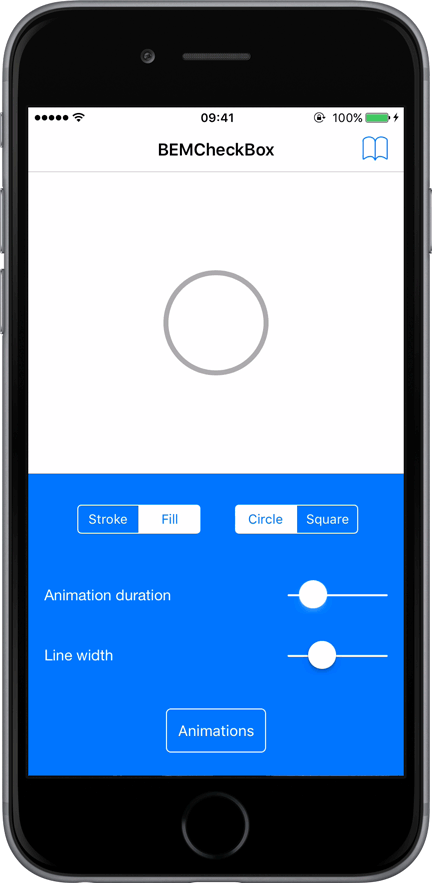
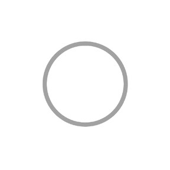
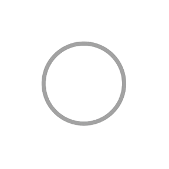
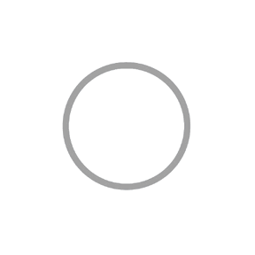
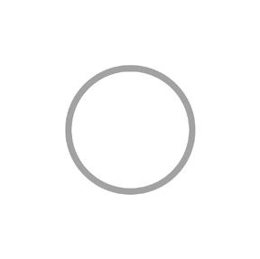
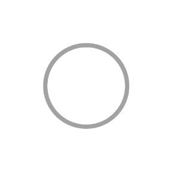
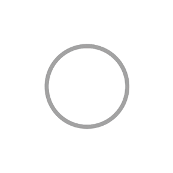

# BEMCheckBox
[](https://github.com/saturdaymp/BEMCheckBox/actions/workflows/ci.yml)
[](https://github.com/saturdaymp/BEMCheckBox/actions/workflows/release-notes.yml)

<p align="center"></p>	

**BEMCheckBox** is an open source library making it easy to create beautiful, highly customizable, animated checkboxes for iOS.  

Forked from [Boris-EM/BEMCheckBox](https://github.com/Boris-Em/BEMCheckBox) because the not been updated in a while and I wanted to use an updated version in the [XPlugins.iOS.BEMCheckBox](https://github.com/saturdaymp/XPlugins.iOS.BEMCheckBox).  I'm not very knowledge about Xcode and Swift so please feel free to help by creating an [issue](https://github.com/saturdaymp/BEMCheckBox/issues) and/or a [pull request](https://github.com/saturdaymp/BEMCheckBox/pulls).

## Table of Contents

* [**Project Details**](#project-details)  
  * [Requirements](#requirements)
  * [License](#license)
  * [Support](#support)
  * [Sample App](#sample-app)
  * [React Native](#react-native)
  * [NativeScript](#nativescript)
  * [Xamarin](#xamarin)
* [**Getting Started**](#getting-started)
  * [Installation](#installation)
  * [Setup](#setup)
* [**Documentation**](#documentation)
  * [Enabling / Disabling the Checkbox](#enabling--disabling-the-checkbox) 
  * [Reloading](#reloading)
  * [Group / Radio Button Functionality](#group--radio-button-functionality)
  * [Delegate](#delegate)
  * [Customization](#customization)

## Project Details
A quick example of the checkbox in action.

<p align="center"></p>	

### Requirements
 - Requires iOS 12 or later.
 - Requires Automatic Reference Counting (ARC).
 - Optimized for ARM64 Architecture.

### License
See the [License](LICENSE). You are free to make changes and use this in either personal or commercial projects. Attribution is not required, but highly appreciated. A little "Thanks!" (or something to that affect) is always welcome for either [Saturday MP](https://github.com/saturdaymp) and/or [Boris-EM](https://github.com/Boris-Em) If you use **BEMCheckBox** in your app, please let us know!

### Support
Open an [issue](https://github.com/saturdaymp/BEMCheckBox/issues) if you have a question, spot a bug, or have a feature request.  [Pull requests](https://github.com/saturdaymp/BEMCheckBox/pulls) are welcome and much appreciated.  Finally you can send an email to [support@saturdaymp.com](support@saturdaymp.com).

### Sample App
The iOS Sample App included with this project demonstrates one way to correctly setup and use **BEMCheckBox**. It also offers the possibility to customize the checkbox within the app.

### React Native  
**BEMCheckBox** can be used with React Native: [React-Native-BEMCheckBox](https://github.com/torifat/react-native-bem-check-box)

### NativeScript  
**BEMCheckBox** can be used with NativeScript: [NativeScript-BEMCheckBox](https://github.com/nstudio/nativescript-checkbox)

### Xamarin
**BEMCheckBox** can also be used with Xamarin: [XPlugins.iOS.BEMCheckBox](https://github.com/saturdaymp/XPlugins.iOS.BEMCheckBox)

## Getting Started
It only takes a few simple steps to install and setup **BEMCheckBox** to your project.

### Installation

#### Swift Package Manager
Add `https://github.com/saturdaymp/BEMCheckBox` as a dependency to your Package.swift file or select `File -> Swift Packages -> Add Package Dependency...` in Xcode.

#### CocoaPods
Note: The latest version on CocoaPods is [v1.4.1](https://cocoapods.org/pods/BEMCheckBox) by [Boris-Em](https://github.com/Boris-Em).  If you would like me to push a new version please open an [issue](https://github.com/saturdaymp/BEMCheckBox/issues) or [pull request](https://github.com/saturdaymp/BEMCheckBox/pulls).

The easiest way to install **BEMCheckBox** is to use <a href="http://cocoapods.org/" target="_blank">CocoaPods</a>. To do so, simply add the following line to your `Podfile`:
	<pre><code>pod 'BEMCheckBox'</code></pre>


#### Carthage
[Carthage](https://github.com/Carthage/Carthage) is a decentralized dependency manager that builds your dependencies and provides you with binary frameworks.

Run `carthage update` after adding **BEMCheckBox** to your Cartfile to build the framework. Drag the built `BEMCheckBox.framework` into your Xcode project.

#### Manually	
Finally, you can install **BEMCheckBox** manually. Simply drag and drop the *Classes* folder into your Xcode project. When you do so, make sure to check the "*Copy items into destination group's folder*" box.

### Setup
Setting up **BEMCheckBox** to your project couldn't be more simple. It is modeled after `UISwitch`. In fact, you could just replace instances of `UISwitch` by **BEMCheckBox** in your project!  
Here are the steps to follow to get everything up and running:

 1. Import `"BEMCheckBox.h"` to the header of your view controller:

 ```objective-c
 #import "BEMCheckBox.h"
 ```

 2. **BEMCheckBox** can either be initialized programatically (through code) or with Interface Builder (Storyboard file). Use the method that makes the most sense for your project.
 
 **Programmatical Initialization**  
 Just add the following code to your implementation (usually in the `viewDidLoad` method of your View Controller).

 ```objective-c
 BEMCheckBox *myCheckBox = [[BEMCheckBox alloc] initWithFrame:CGRectMake(0, 0, 50, 50)];
 [self.view addSubview:myCheckBox];
 ```
 
 **Interface Builder Initialization**  
 1 - Drag a `UIView` to your `UIViewController`.  
 2 - Change the class of the new `UIView` to `BEMCheckBox`.  
 3 - Select the `BEMCheckBox` and open the Attributes Inspector. Most of the customizable properties can easily be set from the Attributes Inspector. The Sample App demonstrates this capability.

## Documentation
All of the methods and properties available for **BEMCheckBox** are documented below.

### Enabling / Disabling the Checkbox
##### The `on` Property
Just like `UISwitch`, **BEMCheckBox** provides the boolean property `on` that allows you to retrieve and set (without animation) a value determining wether the BEMCheckBox object is `on` or `off`. Defaults to `NO`.  
Example usage:
```objective-c
self.myCheckBox.on = YES;
```
##### `setOn:animated:`
Just like `UISwitch`, **BEMCheckBox** provides an instance method `setOn:animated:` that sets the state of the checkbox to On or Off, optionally animating the transition.  
Example usage:
```objective-c
[self.myCheckBox setOn:YES animated:YES];
```

### Reloading
The instance method `reload` lets you redraw the entire checkbox, keeping the current `on` value.  
Example usage:  
```objective-c
[self.myCheckBox reload]
```

### Group / Radio Button Functionality
**BEMCheckBox**es can easily be grouped together to form radio button functionality. This will automatically manage the state of each checkbox in the group, so that only one is selected at a time, and can optionally require that the group has a selection at all times.

```objective-c
self.group = [BEMCheckBoxGroup groupWithCheckBoxes:@[self.checkBox1, self.checkBox2, self.checkBox3]];
self.group.selectedCheckBox = self.checkBox2; // Optionally set which checkbox is pre-selected
self.group.mustHaveSelection = YES; // Define if the group must always have a selection
```

To see which checkbox is selected in that group, just ask for it:
```objective-c
BEMCheckBox *selection = self.group.selectedCheckBox;
```

To manually update the selection for a group, just set it:
```objective-c
self.group.selectedCheckBox = self.checkBox1;
```

### Delegate
**BEMCheckBox** uses a delegate to receive check box events. The delegate object must conform to the `BEMCheckBoxDelegate` protocol, which is composed of two optional methods:

- `didTap:`  
Sent to the delegate every time the check box gets tapped, after its properties are updated (`on`), but before the animations are completed.

- `animationDidStop:`  
Sent to the delegate every time the check box finishes being animated.

### Customization
**BEMCheckBox** is exclusively customizable though properties.  
The following diagram provides a good overview:  
<p align="center"></p>


##### Apparence Properties
`lineWidth` - CGFloat  
The width of the lines of the check mark and box. Defaults to 2.0.  

`hideBox` - BOOL  
BOOL to control if the box should be hidden or not. Setting this property to `YES` will essentially turn the checkbox into a check mark. Defaults to `NO`.

`boxType` - BEMBoxType   
The type of box to use. See `BEMBoxType` for possible values. Defaults to `BEMBoxTypeCircle`. 
<p align="center"></p>

`tintColor` - UIColor  
The color of the box when the checkbox is Off.

`onCheckColor` - UIColor  
The color of the check mark when it is On.

`onFillColor` - UIColor  
The color of the inside of the box when it is On.

`onTintColor` - UIColor  
The color of the line around the box when it is On.

##### Animations
`animationDuration` - CGFloat  
The duration in seconds of the animations. Defaults to `0.5`.

`onAnimationType` - BEMAnimationType  
The type of animation to use when the checkbox gets checked. Defaults to `BEMAnimationTypeStroke`. See `BEMAnimationType` bellow for possible values.

`offAnimationType` - BEMAnimationType  
The type of animation to use when the checkbox gets unchecked. Defaults to `BEMAnimationTypeStroke`. See `BEMAnimationType` bellow for possible values.

`BEMAnimationType`  
The possible values for `onAnimationType` and `offAnimationType`.  
- `BEMAnimationTypeStroke`
<p align="left"></p>

- `BEMAnimationTypeFill`
<p align="left"></p>

- `BEMAnimationTypeBounce`
<p align="left"></p>

- `BEMAnimationTypeFlat`
<p align="left"></p>

- `BEMAnimationTypeOneStroke`
<p align="left"></p>

- `BEMAnimationTypeFade`
<p align="left"></p>
